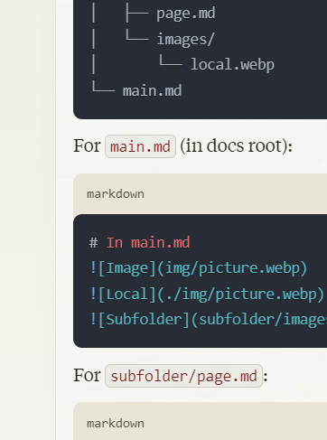

# iframes

Local webpage hidden

<iframe src="https://ocrobotix.github.io/lunarlander/hidden_page/" width="100%" height="600px" style="border:none;">
  Your browser does not support iframes.
</iframe>

NASA Website

<iframe src="https://www.nasa.gov/news-release/nasa-provides-update-on-artemis-iii-moon-landing-regions/" width="100%" height="600px" style="border:none;">
  Your browser does not support iframes.
</iframe>

# Videos

Here is the Apollo Lunar Module descent simulation.
Click the play button below to watch:

<video
    width="640"
    height="360"
    controls
    preload="none"
    poster="../../video/lunar2.png"
    class="video-container">
    <source src="../../docs/video/lunar.mp4" type="video/mp4">
    <source src="../../docs/video/lunar2.mkv" type="video/mp4">
    
Your browser does not support HTML5 video. Please use a modern browser.

</video>

# Images

Method 1

*Image Caption*

`  `` `

Method 2
      Image Caption option 2
####### Image Caption option 3
`  `` `

Method 3

<figure>
    
    <figcaption>This is my caption</figcaption>
</figure>

<figure>
    
    <figcaption>This is my caption</figcaption>
</figure>
