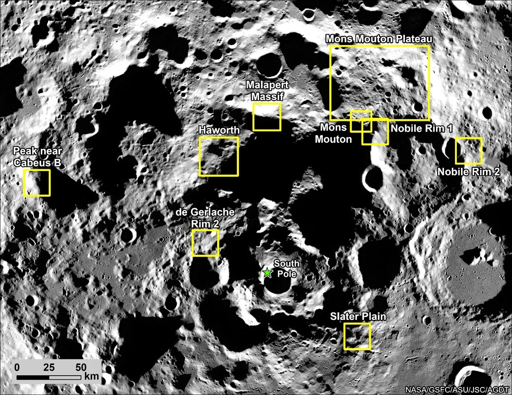

# Background

- [Background](#background)
  - [Background](#background-1)
- [Status](#status)
- [The Mission](#the-mission)

## Background

Apollo Lunar Module descent simulation C/O Mathworks

<video 
    width="640" 
    height="360" 
    controls 
    preload="none" 
    poster="./video/lunar2.png" 
    class="video-container">
    <source src="../video/lunar.mp4" type="video/mp4">
    <source src="../video/lunarorbit.mkv" type="video/webm">
    
Your browser does not support HTML5 video. Please use a modern browser.

</video>

<figure>
    
    <figcaption>This is my caption</figcaption>
</figure>

# Status

# The Mission